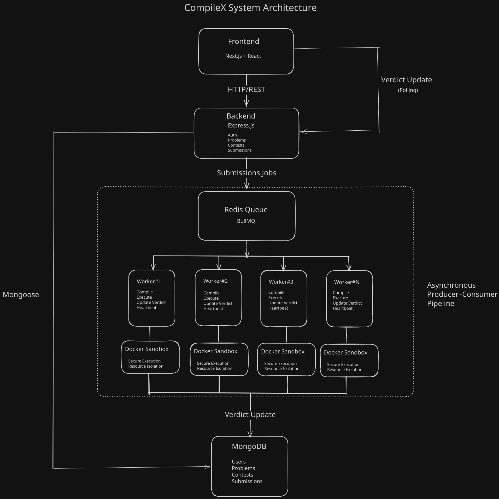
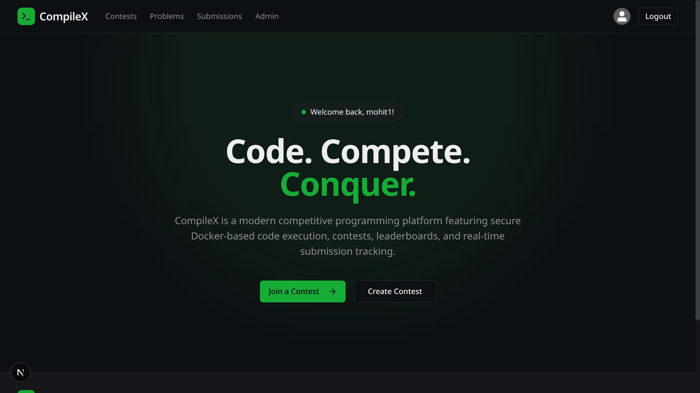
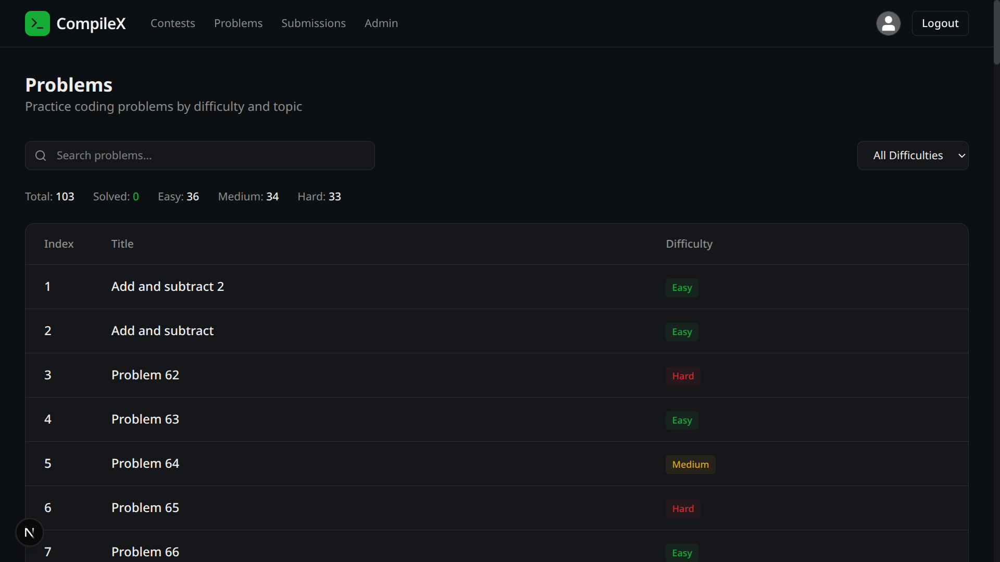
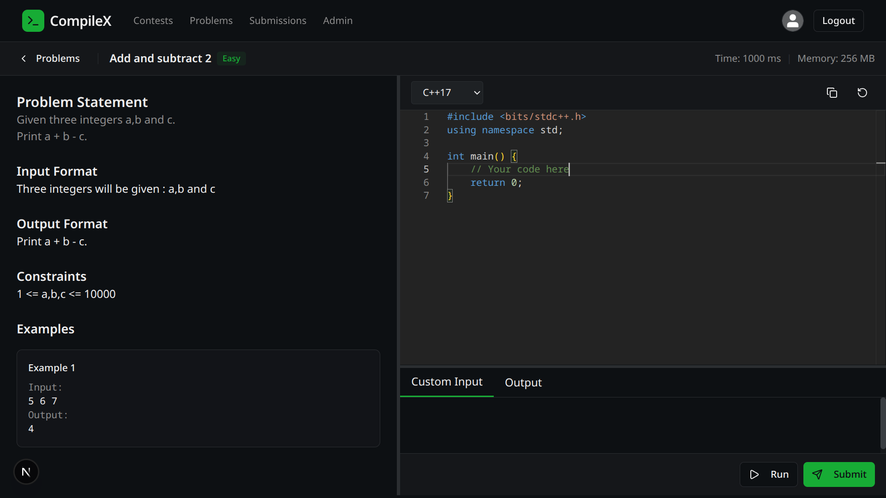
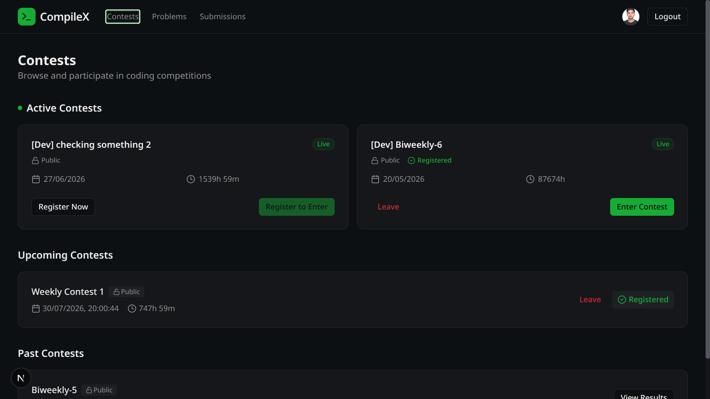
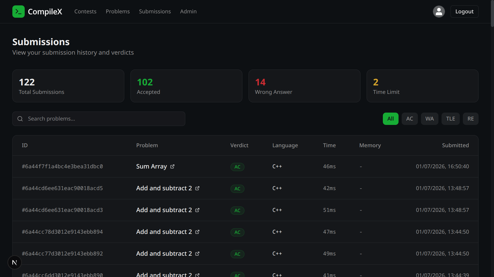
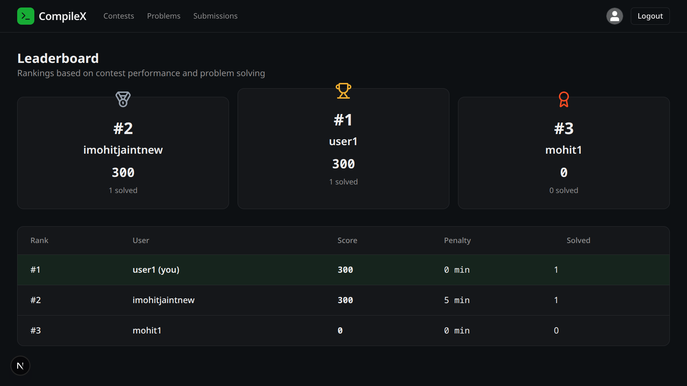
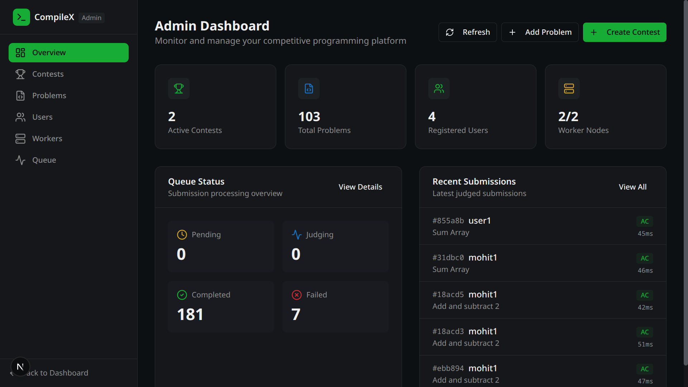
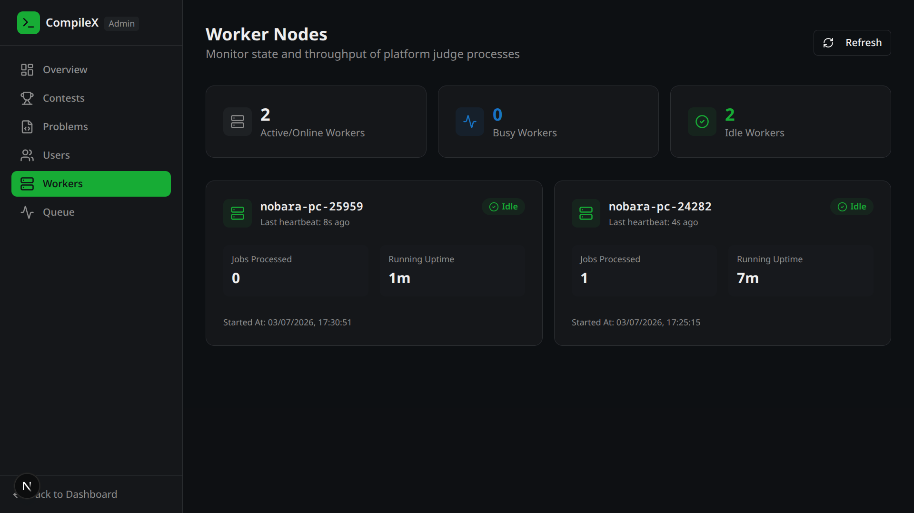

# 🚀 CompileX

## 🌐 **[ Try the Live Demo](https://compile-x-mu.vercel.app/)**
---

> **An asynchronous online judge built on a distributed producer-consumer architecture using BullMQ, Redis, Docker, and MongoDB.**

CompileX is a full-stack competitive programming platform designed for scalable and secure code evaluation. It can be deployed both as a public online judge and as a self-hosted platform for colleges, coding clubs, and organizations to conduct programming contests.

Unlike traditional monolithic online judges, CompileX decouples API request handling from code execution. User submissions are published to a Redis-backed BullMQ queue, where independent worker processes securely execute code inside isolated Docker containers. This architecture keeps the backend responsive while enabling horizontal scaling by simply adding more worker nodes.

> **Built as a learning project to explore scalable backend architecture, asynchronous processing, distributed systems concepts, and secure code execution.**

---
## 📖 Overview

CompileX is a modern competitive programming platform designed for scalable, secure, and asynchronous code evaluation.

The platform allows users to practice coding problems, participate in programming contests, and view live leaderboards. Instead of executing user code directly inside the API server, CompileX follows an asynchronous producer-consumer architecture.

When a submission is received, the backend immediately stores it in the database and publishes a judging job to a Redis-backed BullMQ queue. Dedicated worker processes consume these jobs, compile and execute code inside isolated Docker containers, evaluate the output against hidden test cases, and update the final verdict.

This separation between request handling and code execution significantly improves responsiveness while making the judging system independently scalable.

---
## 💡 Why CompileX?

Traditional implementations often execute user submissions synchronously inside the API server, causing long-running executions to block incoming requests.

CompileX addresses this limitation by separating the judging pipeline into independent services:

- The **Backend** handles authentication, contests, problems, and submission creation.
- **Redis + BullMQ** acts as the message broker between services.
- Independent **Worker Nodes** consume submissions asynchronously.
- **Docker** securely compiles and executes untrusted user code in isolated containers.

This design keeps the API responsive while allowing the judging infrastructure to scale horizontally by adding additional worker processes.

---

## 🎯 Use Cases

CompileX is designed to be flexible enough for both individual practice and institutional deployments.

- 👨‍💻 **Competitive Programming Practice** – Solve coding problems with real-time verdicts and submission history.
- 🏆 **Programming Contests** – Host contests with live leaderboards, penalties, and automated judging.
- 🏫 **College Programming Events** – Deploy CompileX within a college network (LAN) to conduct coding competitions without relying on external online judges.
- 🏢 **Organization & Club Assessments** – Create private coding rounds for recruitment, workshops, hackathons, or internal evaluations.
- 🧪 **Learning Distributed Systems** – Explore asynchronous processing, job queues, Docker sandboxing, and scalable backend architecture.

---

## 🏗️ System Architecture

CompileX follows an **asynchronous producer-consumer architecture**, where API request handling is decoupled from code execution.



---
## 📸 UI Preview

#### Landing Page

#### Problems


#### Contest

#### Submission

#### Leaderboard

#### Admin Dashboard



---
## ⚙️ Submission Lifecycle

Every submission passes through the following pipeline:

1. **User submits code** from the frontend.
2. The **Backend API** validates the request and stores the submission in MongoDB with a `Pending` status.
3. A judging job is published to a **Redis-backed BullMQ queue**.
4. An available **Worker** consumes the job asynchronously.
5. The worker launches an isolated **Docker container** to securely compile and execute the submitted program.
6. The program is evaluated against all hidden test cases.
7. The final verdict, execution time, and memory usage are stored back in MongoDB.
8. The frontend automatically reflects the updated submission status.

This architecture keeps the API responsive while allowing the judging system to scale independently by simply adding more worker processes.

---

## 🧠 Architectural Decisions

Executing user code is a computationally expensive operation that may take several seconds.

Instead of blocking the API server while judging submissions, CompileX separates request handling from code execution using a producer-consumer architecture.

This provides several advantages:

- ⚡ **Responsive API** — Users receive an immediate response after submitting code.
- 🔄 **Asynchronous Processing** — Judging happens independently in the background.
- 📈 **Horizontal Scalability** — Additional worker nodes can be added without modifying the backend.
- 🔒 **Secure Execution** — Untrusted code runs inside isolated Docker containers.
- 🧩 **Loose Coupling** — Backend services remain independent from the judging infrastructure.

---

> **Why BullMQ?**
>
>BullMQ provides a reliable Redis-backed job queue that enables asynchronous processing, retry mechanisms, delayed jobs, and horizontal scaling. It allows the backend to remain responsive by delegating computationally expensive judging tasks to independent worker processes.

---

## ✨ Features

### 👤 User Management

- JWT Authentication
- Role-based Authorization
- User Profiles
- Secure Account Deletion

### 📚 Problem Management

- CRUD Operations
- Hidden Test Cases
- Difficulty & Tags
- Markdown Descriptions

### 🏆 Contest System

- Contest Creation
- Contest Registration
- Live Leaderboard
- Penalty Calculation

### ⚙️ Online Judge

- Docker Sandboxed Execution
- Background Judging using BullMQ
- Hidden Test Cases
- Compilation Errors
- Runtime Errors
- Time Limit Exceeded
- Wrong Answer Detection
- Execution Time
- Memory Usage

### 🚀 Distributed Architecture

- Redis
- BullMQ
- Independent Worker Nodes
- Worker Heartbeat
- Queue Monitoring

---

## 🛠️ Technology Stack

| Layer | Technologies |
|--------|--------------|
| Frontend | Next.js, React, Tailwind CSS |
| Backend | Node.js, Express.js |
| Database | MongoDB |
| Queue | Redis, BullMQ |
| Sandbox | Docker |
| Authentication | JWT |

---

## 📂 Project Structure

```text
CompileX
│
├── assets/                     # README assets and screenshots
│
├── frontend/                   # Next.js Frontend
│   ├── app/                    # App Router pages
│   ├── components/             # Reusable UI components
│   ├── context/                # Authentication context
│   ├── hooks/                  # Custom React hooks
│   ├── lib/                    # API client and utilities
│   └── public/                 # Static assets
│
├── backend/                    # Express.js Backend
│   ├── src/
│   │   ├── controllers/        # Route controllers
│   │   ├── routes/             # API routes
│   │   ├── models/             # MongoDB models
│   │   ├── middlewares/        # Authentication & validation
│   │   ├── services/           # Business logic & judge service
│   │   ├── queue/              # BullMQ producer & Redis config
│   │   ├── worker/             # Judge worker & heartbeat
│   │   ├── db/                 # Database connection
│   │   ├── utils/              # Utility functions
│   │   ├── app.js              # Express application
│   │   ├── index.js            # Backend entry point
│   │   └── worker.js           # Worker entry point
│   │
│   ├── storage/                # Uploaded test cases
│   ├── scripts/                # Database seed scripts
│   ├── Dockerfile
│   └── docker-compose.yaml
│
└── README.md
```

---

## 🚀 Getting Started

### Prerequisites

Make sure the following are installed on your system:

- Node.js (v20+ recommended)
- Docker
- MongoDB
- Redis

---

### Clone the Repository

```bash
git clone https://github.com/Amrndra/CodeForge.git
cd CodeForge
```

---

### Configure Environment Variables

Create `.env` files for both the frontend and backend.

```bash
cp backend/.env.example backend/.env
cp frontend/.env.example frontend/.env
```

Update the environment variables according to your local setup.

---

### Install Dependencies

```bash
cd backend
npm install

cd ../frontend
npm install
```

---

### Start Required Services

Ensure MongoDB, Redis, and Docker are running before starting the application.

---

### Run the Application

Open **three separate terminals**.

#### Terminal 1 — Backend API

```bash
cd backend
npm run dev
```

#### Terminal 2 — Judge Worker

```bash
cd backend
npm run worker
```

#### Terminal 3 — Frontend

```bash
cd frontend
npm run dev
```

The application will now be available at:

- **Frontend:** `http://localhost:3000`
- **Backend:** `http://localhost:5000` *(or your configured port)*

---

## 🔮 Future Work

- Multi-language support
- WebSocket-based live verdict updates
- Distributed deployment across multiple machines
- Autoscaling worker nodes
- Rejudge functionality
- Plagiarism detection
- Enhanced monitoring dashboard

---

## 🧩 Engineering Challenges

During development, several architectural challenges were addressed:

- Secure execution of untrusted user code using Docker containers.
- Decoupling request handling from code execution using BullMQ.
- Designing a scalable producer-consumer architecture.
- Docker Compose support for one-command deployment of frontend, backend, worker, MongoDB, and Redis.
- Tracking worker availability through Redis heartbeats.
- Managing contest leaderboards and penalty calculations.
- Preventing API blocking caused by long-running code execution.

---

## 📄 License

This project is licensed under the MIT License. See the [LICENSE](LICENSE) file for details.
